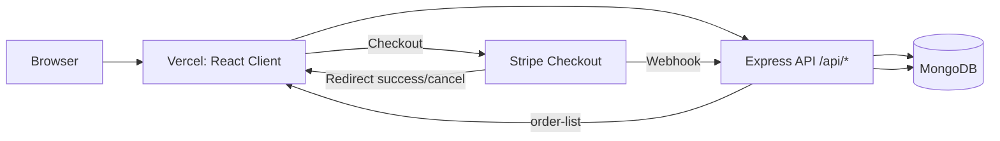
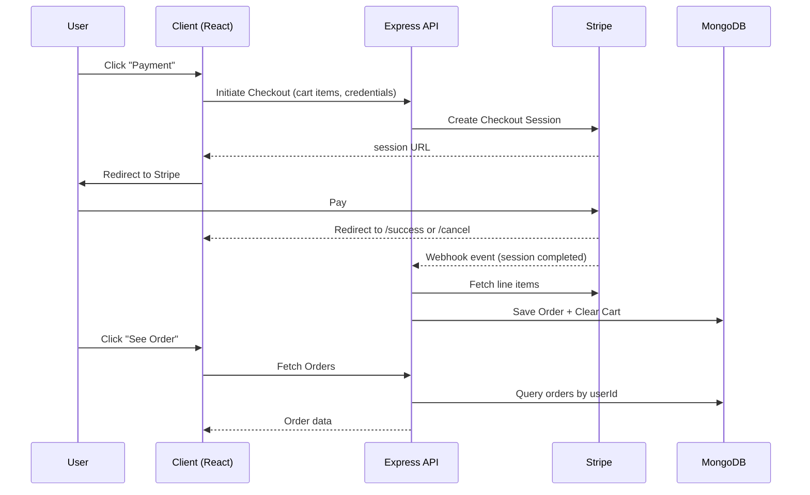
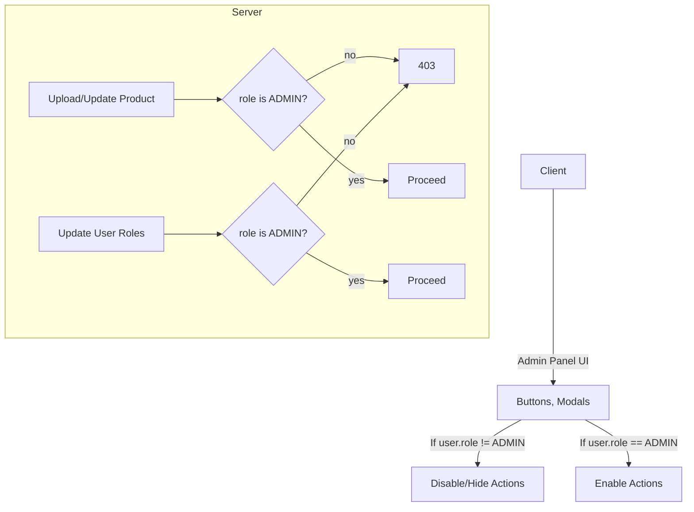

# Bilal Ecommerce (MERN)

Modern MERN e‑commerce app with Stripe payments, role‑based admin panel, and a Vite + Tailwind React frontend. This document provides an executive‑level overview, architecture, modules, and flows — intentionally excluding setup/run instructions.

## Highlights

- Product catalog with category browsing, search, and details
- Cart with quantity management and live totals
- Stripe Checkout with secure server‑side webhooks and order persistence
- Orders timeline with payment status and shipping details
- Role‑based Admin Panel; users can view in read‑only mode for demos
- Clean React architecture with Redux Toolkit for user state and lightweight Context for cart count

## Monorepo Structure (Overview)

```
2-Bilal-Ecommerce/
├─ client/        # React app (Vite)
├─ server/        # Express API
├─ vercel.json    # Client deploy config
└─ README.md
```

## Feature Matrix

- Home: category‑wise carousels, horizontal/vertical product cards
- Search: instant route‑based filtering with result counts
- Product Details: images gallery, zoom behavior, pricing (MRP vs selling)
- Cart: add/remove/update, total qty and amount, guarded checkout
- Checkout: redirects to Stripe session
- Orders: list, created timestamp, line items, totals, payment status
- Admin: all products list, edit modal; all users list, role edit (admin only)

## High‑Level Architecture



## Checkout to Order Flow



## Role & Permissions (Read‑Only Demo for Users)



## Frontend Modules

- State
  - Redux Toolkit: user details
  - React Context: cart count utility
- Routing
  - React Router nested routes with a shared layout (Header/Footer)
  - Guard‑like UX in Admin Panel via UI capability toggles
- UI/UX
  - TailwindCSS utility classes
  - Skeletons for async content
  - Moment.js for human‑readable timestamps

## Backend Modules

- Auth: cookie‑based JWT; middleware injects `req.userId`
- Products: upload, update, category browsing, search/filter
- Cart: add/view/update/delete
- Checkout: Stripe session creation with item metadata
- Webhooks: verified raw‑body route for event handling; creates orders and clears cart
- Orders: per‑user listing, newest first
- Permissions: centralized helper to allow admin‑only mutations

## Data Models (Conceptual)

- User
  - name, email, role, profilePic, timestamps
- Product
  - productName, brandName, category, productImage[], description, price, sellingPrice
- CartItem
  - userId, productId, quantity
- Order
  - userId, email, productDetails[], paymentDetails, shipping_options[], totalAmount, timestamps

## Security & Privacy

- Secrets remain only in server environment variables (never committed)
- CORS restricted to the deployed frontend origin with credentials
- Stripe webhook endpoint consumes verified signatures with raw payload
- All admin mutations are re‑checked on server regardless of UI state

## Demo & Presentation Notes

- Admin Panel is browseable by non‑admin users for showcasing UI, while all destructive/admin actions remain disabled and server‑protected.
- SPA routing is configured for deep links (e.g., orders, product details).
- Currency helpers standardize displayed prices across the app.

## Usage & Rights

- This repository and its contents are proprietary and for demonstration purposes only.
- Redistribution, copying, or using this codebase without explicit permission is not allowed.
- No setup, run, or deployment instructions are provided here by design.

---

Developed by Bilal — Happy Shipping!
