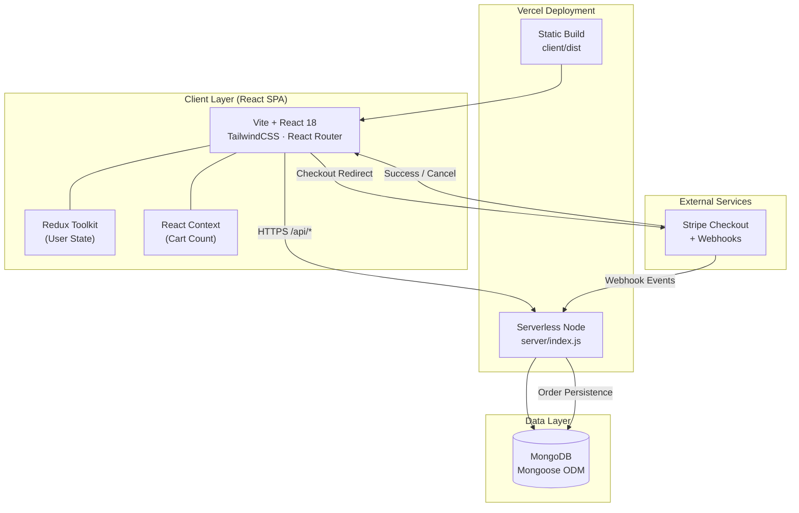
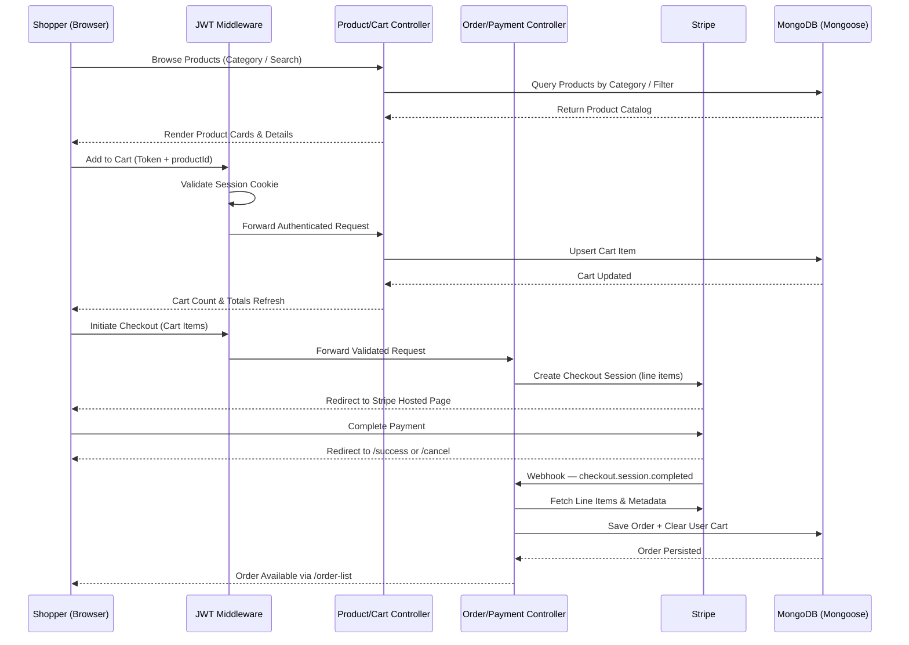

# 🛒 BilalShop • Enterprise-Grade MERN E-Commerce Platform

---

## 🏷️ Badges


---

## 📖 Executive Summary

**BilalShop** is a full-stack MERN e-commerce platform built for modern online retail — featuring a **Vite + React** storefront, an **Express REST API**, **MongoDB** persistence, **JWT cookie-based authentication**, and **Stripe Checkout** with verified webhooks. The monorepo deploys as a unified Vercel project where the React SPA and Node API coexist under a single domain. Role-based access separates shopper and admin experiences while keeping the admin panel browsable in read-only mode for demos.

---

## 📸 Visual Tour

### Home & Catalog

| Home — Category Carousels | Home — More Categories |
|:---:|:---:|
|  |  |

| Home — Scroll View | Home — Full Page |
|:---:|:---:|
|  |  |

### Product Discovery

| Product Details | Category Browse |
|:---:|:---:|
|  |  |
|  | |

### Cart & Checkout

| Shopping Cart | Stripe Checkout |
|:---:|:---:|
|  |  |

| Payment Success |
|:---:|
|  |

### Orders & Authentication

| Order History | Login Page |
|:---:|:---:|
|  |  |

### Admin Panel

| All Products | Upload Product Modal |
|:---:|:---:|
|  |  |

| Edit Product | All Users |
|:---:|:---:|
|  |  |

---

## 📊 High-Level Architecture


```mermaid
flowchart TB
  subgraph Client["Client Layer (React SPA)"]
    UI["Vite + React 18<br/>TailwindCSS · React Router"]
    ST["Redux Toolkit<br/>(User State)"]
    CTX["React Context<br/>(Cart Count)"]
    UI --- ST
    UI --- CTX
  end

  subgraph Vercel["Vercel Deployment"]
    SPA["Static Build<br/>client/dist"]
    API["Serverless Node<br/>server/index.js"]
  end

  subgraph External["External Services"]
    STR["Stripe Checkout<br/>+ Webhooks"]
  end

  subgraph Data["Data Layer"]
    DB[("MongoDB<br/>Mongoose ODM")]
  end

  UI -->|"HTTPS /api/*"| API
  SPA --> UI
  API --> DB
  UI -->|"Checkout Redirect"| STR
  STR -->|"Webhook Events"| API
  STR -->|"Success / Cancel"| UI
  API -->|"Order Persistence"| DB
```

---

## 📊 Low-Level Architecture


```mermaid
sequenceDiagram
  participant U as Shopper (Browser)
  participant JWT as JWT Middleware
  participant PC as Product/Cart Controller
  participant OC as Order/Payment Controller
  participant ST as Stripe
  participant DB as MongoDB (Mongoose)

  U->>PC: Browse Products (Category / Search)
  PC->>DB: Query Products by Category / Filter
  DB-->>PC: Return Product Catalog
  PC-->>U: Render Product Cards & Details

  U->>JWT: Add to Cart (Token + productId)
  JWT->>JWT: Validate Session Cookie
  JWT->>PC: Forward Authenticated Request
  PC->>DB: Upsert Cart Item
  DB-->>PC: Cart Updated
  PC-->>U: Cart Count & Totals Refresh

  U->>JWT: Initiate Checkout (Cart Items)
  JWT->>OC: Forward Validated Request
  OC->>ST: Create Checkout Session (line items)
  ST-->>U: Redirect to Stripe Hosted Page
  U->>ST: Complete Payment
  ST-->>U: Redirect to /success or /cancel
  ST->>OC: Webhook — checkout.session.completed
  OC->>ST: Fetch Line Items & Metadata
  OC->>DB: Save Order + Clear User Cart
  DB-->>OC: Order Persisted
  OC-->>U: Order Available via /order-list
```

---

## ✨ Core Modules & Capabilities

**1) Shopper Ecosystem (User-End)**

- **Product Discovery:** Category-wise carousels, search, and filter-driven browsing across electronics, appliances, and accessories.
- **Dynamic Cart Management:** Add, update quantity, and remove items with live totals and cart badge synchronization.
- **Stripe Checkout Flow:** Secure hosted payment with success/cancel redirects and server-side order creation via webhooks.
- **Order History:** Timestamped order timeline with line items, payment status, and shipping details.

**2) Administrative Control (Admin-End)**

- **Product Orchestration:** Upload new products with images, pricing, and descriptions; inline edit via modal forms.
- **Catalog Oversight:** Full product grid with search integration and category management.
- **User Management:** Centralized user list with role assignment (Admin / General) protected by server-side permission checks.

**3) Architectural Excellence**

- **Unified Vercel Deployment:** Single-domain monorepo with SPA rewrites and `/api/*` routing to the Express server.
- **Hybrid State Management:** Redux Toolkit for authenticated user state; lightweight Context for cart count propagation.
- **Defense-in-Depth Permissions:** UI-level read-only demo mode for non-admins with server-side role re-validation on every mutation.

---

## 🧰 Technology Stack

| Layer | Technology | Purpose |
|:---|:---|:---|
| **Frontend** | React 18, Vite, TailwindCSS | Fast SPA with utility-first styling and hot module replacement |
| **Routing** | React Router v6 | Nested routes with shared layout (Header / Footer) |
| **State** | Redux Toolkit, React Context | User session persistence and cart count utility |
| **Backend** | Node.js, Express (ES6+) | Scalable REST API for products, cart, auth, and orders |
| **Database** | MongoDB + Mongoose | Document storage for users, products, cart items, and orders |
| **Auth** | JWT + HTTP-only Cookies | Secure session management with middleware injection |
| **Payments** | Stripe Checkout + Webhooks | Hosted payment flow with verified server-side order creation |
| **Deployment** | Vercel (Static + Serverless) | Unified client + API deployment via `vercel.json` rewrites |
| **UI Utilities** | Moment.js, React Toastify, React Icons | Timestamps, notifications, and iconography |

---

## 📂 Project Structure

```
2-Bilal-Ecommerce/
├── client/                          # React SPA (Vite)
│   ├── src/
│   │   ├── pages/                   # Route-level views (Home, Cart, Admin, etc.)
│   │   ├── components/              # Reusable UI (Header, Product Cards, Modals)
│   │   ├── store/                   # Redux Toolkit slices (user state)
│   │   ├── context/                 # Cart count context provider
│   │   ├── helpers/                 # Currency, cart, upload, category utilities
│   │   └── routes/                  # React Router configuration
│   └── vite.config.js               # Vite build configuration
├── server/                          # Express REST API
│   ├── controller/                  # Route handlers (user, product, order)
│   ├── models/                      # Mongoose schemas (User, Product, Cart, Order)
│   ├── middleware/                  # JWT auth token validation
│   ├── config/                      # Database & Stripe configuration
│   ├── helpers/                     # Permission & role utilities
│   └── routes/                      # API route definitions (/api/*)
├── assets/                          # README visual tour screenshots
│   └── BilalShop - Ecommerce/       # Application UI captures
├── vercel.json                      # Unified deployment & rewrite rules
└── README.md                        # Project documentation (this file)
```

---

## 📌 Experience Highlights

- **Unified Monorepo Deployment:** Client and API share a single Vercel project with intelligent rewrites — no CORS friction in production.
- **End-to-End Commerce Flow:** Browse → Cart → Stripe Checkout → Webhook Order → Order History, fully wired across frontend and backend.
- **Role-Aware Admin Panel:** Admin users get full CRUD; regular users see the same UI in read-only mode for portfolio demos.
- **Real-Time Cart Synchronization:** Cart count badge and totals update instantly across all pages via Context + API calls.
- **Secure Payment Pipeline:** Stripe webhook signature verification with raw-body parsing ensures only legitimate events create orders.

---

## 🖥️ Screens Overview

- **Home & Explore:** Category icon bar, promotional banner carousel, and horizontal product sliders by category.
- **Product Details & Cart:** Image gallery with thumbnails, MRP vs selling price, quantity controls, and order summary sidebar.
- **Checkout & Orders:** Stripe hosted checkout, payment success confirmation, and chronological order history with line-item breakdown.
- **Authentication:** Login, sign-up, and forgot-password flows with cookie-based session persistence.
- **Admin Panel:** All Products grid with upload/edit modals, and All Users list with role management (admin-only mutations).

---

## 🖋️ Feature Summary

- **Dynamic Networking:** RESTful `/api/*` endpoints with credential-aware CORS for authenticated cart and checkout operations.
- **State Management:** Redux for user identity; React Context for lightweight cart count without over-engineering global state.
- **Search & Filter:** Route-based product search and category-wise filtering with instant result rendering.
- **Image Handling:** Base64 product image upload and display with responsive card layouts across the catalog.
- **SPA Deep Linking:** Vercel rewrites ensure direct navigation to `/product/:id`, `/order`, `/admin-panel`, and other routes.

---

## 🔒 Notes & Security

- **Environment Safety:** All secrets (MongoDB URI, JWT secret, Stripe keys) live exclusively in server environment variables — never committed to source.
- **CORS Management:** Production CORS is restricted to the deployed frontend origin with `credentials: true` for cookie transport.
- **Webhook Integrity:** Stripe webhook endpoint consumes raw request bodies and verifies signatures before processing payment events.
- **Server-Side Authorization:** Admin-only routes (upload product, update user role) re-check permissions via centralized helper — UI toggles alone cannot bypass access control.
- **Database Atomicity:** Order creation and cart clearing happen in the webhook handler after verified Stripe session completion.

---

## 📄 License & Rights

This repository and its contents are **proprietary** and intended for **demonstration purposes only**. Redistribution, copying, or using this codebase without explicit permission is not allowed.

---

Developed by **Bilal** — Happy Shipping! 🚀
